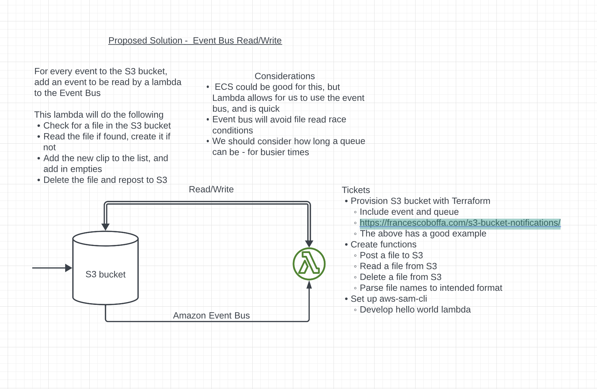

# S3-Lambda-Media-Playlist-Generator

An S3 Bucket with Event Bus to organise incoming media files from a CDN.

This follows the following design:




## How to use
At present this requires deploying locally with access tokens
These can be found through the AWS UI. IAM > Security Credentials >  Access Keys.

These can also be set up for individual user groups in the Account created through IAM.

```bash
$ terraform init
```

```bash
$ terraform plan -out planfile
```

```bash
$ terraform apply
```

## The code
* All infrastructure is in `/infra`
* Lambda code is in `/src` and zips on terraform apply
* Test data that can be added to the Lambda for testing is in `/test-data`

## Up next
* Refactoring the Terraform (policies/modules)
* Create logic to create playlists and ToC for new show
* Create logic to read playlist files and edit to add new/empty
* Testing for high loads to ensure resilience
